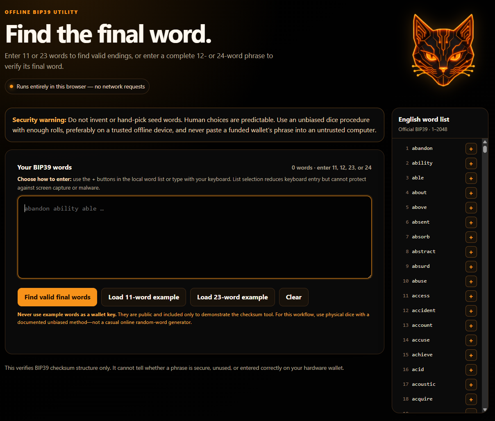

# BIP39 Offline Dice-Roll Checksum

This tool helps you finish or check a 12-word or 24-word BIP39 seed phrase made with dice.

It runs entirely in your browser. You do not need to install anything, start a server, or connect to the internet.

The app does not read from the clipboard or copy anything to it. Your words stay in the page's memory until you clear or close the page.



## Why this tool exists

The last word of a BIP39 seed phrase cannot be any word you want. Part of the last word is a built-in error check called a checksum.

This is why people can roll dice, choose words from the official list, and still have their wallet reject the finished phrase. The last word may have the wrong checksum.

This tool finds last words that pass the checksum test. It works with both 12-word and 24-word seed phrases.

I used an earlier version of this tool when I made my own key. I am sharing it because people should have a simple tool that they can inspect and run offline.

## How to use it

1. Download this repository.
2. Keep `index.html`, `app.js`, `bip39-wordlist.js`, and the `assets` folder together.
3. Disconnect the computer from the internet.
4. Drag `index.html` into your browser. You can also double-click it.
5. Choose what you want to do:
   - Enter 11 words to find possible 12th words.
   - Enter all 12 words to check the 12th word.
   - Enter 23 words to find possible 24th words.
   - Enter all 24 words to check the 24th word.
6. Click **Find valid final words**.

You can type the words yourself or use the `+` buttons next to the words in the list. The full English BIP39 word list is built into the tool and works offline.

If you enter a complete phrase with a bad last word, the tool shows valid replacements. It puts the replacement that keeps the random part of your dice-picked last word first.

## Never use the examples as real keys

The example buttons load the first 11 or 23 words from the public BIP39 list. Everyone can see and guess these words.

**Never use an example phrase to hold money. The examples are only there to show how the tool works.**

## Make the seed with real randomness

A phrase can pass the checksum test and still be unsafe. This tool only checks the last word. It cannot tell you whether the rest of the phrase is random or secure.

This tool does not turn dice rolls into seed words. You must follow and verify your chosen dice-to-word method yourself. The app deliberately limits automation to checking the BIP39 checksum.

- Do not pick words because you like them.
- Do not use an ordinary online random-word website.
- For this method, use physical dice and follow a trusted guide that explains how to remove bias and make enough rolls.
- A trusted hardware wallet or a properly tested offline cryptographic generator is another valid way to make a seed.

## Check the code before entering secret words

The project is intentionally small. Read the source code yourself or ask an AI coding assistant to review the unchanged files. Check that:

- every script and image is stored locally;
- the app makes no internet requests;
- there are no ads, analytics, or tracking tools;
- the app does not save your words in browser storage; and
- the checksum code follows BIP39.

An AI review can help, but it cannot promise that a computer is safe. **Never give your seed phrase to an AI service. Never upload a screenshot containing your seed phrase.** Ask the AI to review the source code only.

## Download and check a release

Ready-to-open ZIP files are published on the [GitHub Releases page](https://github.com/neko-legends/bip39-offline-dice-roll-checksum/releases). Each release also includes a file named `SHA256SUMS`.

The SHA-256 value lets you check that your ZIP is exactly the file that was published.

On Windows PowerShell, run:

```powershell
Get-FileHash .\bip39-offline-dice-roll-checksum-VERSION.zip -Algorithm SHA256
```

On macOS or Linux, run:

```sh
shasum -a 256 bip39-offline-dice-roll-checksum-VERSION.zip
```

Compare the result with `SHA256SUMS`. The values must match exactly. Do this before moving the files to the offline computer.

## Run the tests

The tests work offline and do not download packages:

```sh
npm test
```

They compare the app's SHA-256 code with Node.js 1,000 times and check 16 official English BIP39 test cases. They also check the word list, public examples, clipboard removal, and the absence of network or browser-storage code.

The official test cases come from the MIT-licensed [Trezor python-mnemonic project](https://github.com/trezor/python-mnemonic/blob/master/vectors.json). They are stored as entropy and hashes rather than usable example phrases.

## Safety warnings

- Use a trusted computer that is disconnected from the internet.
- Malware, browser extensions, screen-recording software, clipboard history, and other programs may still see your words.
- Clicking words instead of typing them may reduce keyboard exposure, but it does not stop screen capture or malware.
- The app has no copy-to-clipboard feature. This avoids placing a completed phrase in clipboard history.
- Do not enter the seed phrase of a wallet that already holds money just to test this tool.
- Check the finished phrase on the hardware wallet where you plan to use it.
- Test that you can restore the wallet before sending it a large amount of money.

## What is included

- `index.html` is the page you open.
- `app.js` checks the words and calculates the checksum.
- `bip39-wordlist.js` contains the official 2,048 English BIP39 words.
- `assets/cat-logo.webp` is the cat logo.
- `assets/app-screenshot.webp` is the screenshot shown in this README.
- `tests/` contains the offline checks.
- `scripts/build_release.py` makes the same release ZIP every time from the same files.
- `.github/workflows/release.yml` tests tagged versions and publishes the ZIP with `SHA256SUMS`.

The tool does not need PHP, a web server, or an internet connection.
